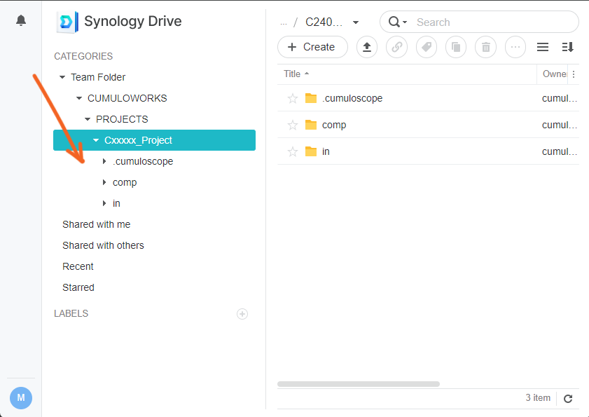
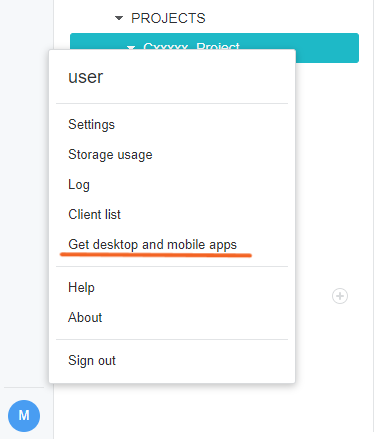
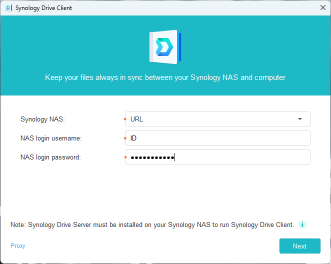
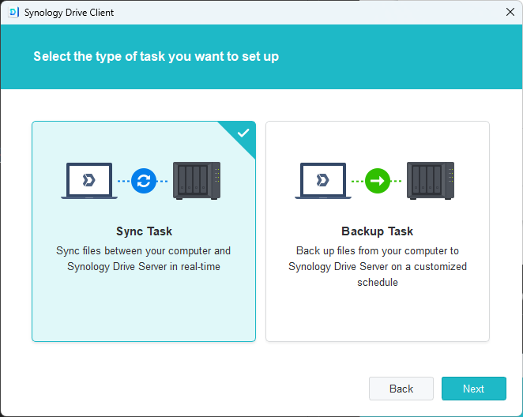
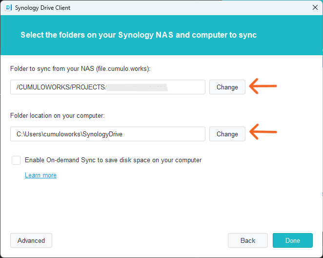

# 🖥️ Cumuloworks サーバー 同期設定 🔄

このドキュメントでは、Cumuloworks, Inc.のサーバーの作業ディレクトリとローカルストレージの作業ディレクトリを同期するための設定方法を説明します。

## 🔑 ログインIDとパスワード

接続には、Cumuloworksから別途共有する以下の情報が必要です：

1. 🌐 URL
2. 👤 ID
3. 🔒 パスワード

## 1. 🚪 ログイン

URLからログインして、`CUMULOWORKS\PROJECTS\Cxxxxx_プロジェクトフォルダ`が開けることを確認してください。

## 2. 💻 Synology Drive Clientのインストール

左下のユーザーアイコンをクリックして、デスクトップアプリケーションをダウンロードしてインストールしてください。

## 3. 🔧 同期のセットアップ

### 1. 📝 URL, ID, パスワードを入力
   

### 2. 🔄 Sync Task (同期タスク) を選択

### 3. 📂 リモートフォルダとローカルフォルダをを選択

- 💡ローカルフォルダを選択するとき、"Synology Drive"サブフォルダを作成するか選択できます。
- 💡オンデマンドで同期するか、すべてのファイルを同期するか選択できます。

### 4. ✅️ 同期が開始されたことを確認

ローカルフォルダを開いて、同期が開始されたことを確認してください。

## 📚 資料

[公式ナレッジベース Synology Drive Client](https://kb.synology.com/ja-jp/DSM/help/SynologyDriveClient/synologydriveclient?version=7)